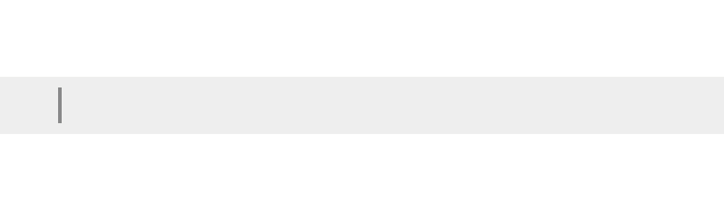
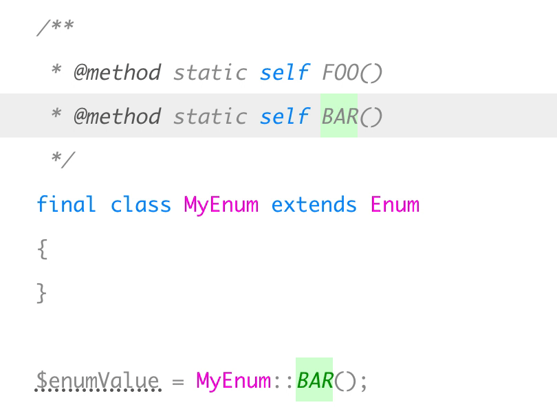

# PHP Enum

[](https://packagist.org/packages/spatie/enum)
[](https://github.com/spatie/enum/blob/master/LICENSE.md)


[](https://packagist.org/packages/spatie/enum)
[](https://github.com/spatie/enum/actions?query=workflow%3Arun-tests)
[](https://github.styleci.io/repos/169538841)
[](https://scrutinizer-ci.com/g/spatie/enum)
[](https://coveralls.io/github/spatie/enum)
[](https://packagist.org/packages/spatie/enum)

This package offers strongly typed enums in PHP. We don't use a simple "value" representation, so you're always working with the enum object. This allows for proper autocompletion and refactoring in IDEs.

Here's how enums are created with this package:

```php
/**
 * @method static self draft()
 * @method static self published()
 * @method static self archived()
 */
class StatusEnum extends Enum
{
}
```

And this is how they are used:

```php
public function setStatus(StatusEnum $status): void
{
    $this->status = $status;
}

// ...

$class->setStatus(StatusEnum::draft());
```

## Support us

Learn how to create a package like this one, by watching our premium video course:

[](https://laravelpackage.training)

We invest a lot of resources into creating [best in class open source packages](https://spatie.be/open-source). You can support us by [buying one of our paid products](https://spatie.be/open-source/support-us).

We highly appreciate you sending us a postcard from your hometown, mentioning which of our package(s) you are using. You'll find our address on [our contact page](https://spatie.be/about-us). We publish all received postcards on [our virtual postcard wall](https://spatie.be/open-source/postcards).

## Installation

You can install the package via composer:

```bash
composer require spatie/enum
```

## Usage

This is how an enum can be defined.

```php
/**
 * @method static self draft()
 * @method static self published()
 * @method static self archived()
 */
class StatusEnum extends Enum
{
}
```

This is how they are used:

```php
public function setStatus(StatusEnum $status)
{
    $this->status = $status;
}

// ...

$class->setStatus(StatusEnum::draft());
```





### Creating an enum from a value

```php
$status = StatusEnum::make('draft');
```

### Override enum values

By default, the string value of an enum is simply the name of that method. In the previous example it would be `draft`.

You can override the value or the index by overriding the `getValue()` or `getIndex()` method:

```php
class StatusEnum extends Enum
{
    public static function draft(): StatusEnum
    {
        return new class() extends StatusEnum {
            public function getValue(): string
            {
                return 'status.draft';
            }
            public function getIndex(): int
            {
                return 10;
            }
        };
    }
    
    public static function published(): StatusEnum
    {
        return new class() extends StatusEnum {
            public function getValue(): string
            {
                return 'status.published';
            }
            public function getIndex(): int
            {
                return 20;
            }
        };
    }
    
    public static function archived(): StatusEnum
    {
        return new class() extends StatusEnum {
            public function getValue(): string
            {
                return 'status.archived';
            }
            public function getIndex(): int
            {
                return -10;
            }
        };
    }
}
```

Overriding these methods is always optional but if you want to rely on the index we recommend to define them yourself. Otherwise they could easily change - we only use array index.

### Comparing enums

Enums can be compared using the `isEqual` method:

```php
$status->isEqual($otherStatus);
```

You can also use dynamic `is` methods:

```php
$status->isDraft(); // return a boolean
StatusEnum::isDraft($status); // return a boolean
```

Note that if you want auto completion on these `is` methods, you must add extra doc blocks on your enum classes. 

### Enum specific methods

There might be a case where you want to have functionality depending on the concrete enum value.

There are several ways to do this:

- Add a function in the enum class and using a switch statement or array mapping.
- Use a separate class which contains this switch logic, something like enum extensions in C#.
- Use enum specific methods, similar to Java. 

This package also supports these enum specific methods. 

By declaring the enum class itself as abstract, and using static constructors instead of doc comments, you're able to return an anonymous class per enum, each of them implementing the required methods.

### Testing

``` bash
composer test
```

### Changelog

Please see [CHANGELOG](CHANGELOG.md) for more information on what has changed recently.

## Contributing

Please see [CONTRIBUTING](CONTRIBUTING.md) for details.

### Security

If you discover any security related issues, please email freek@spatie.be instead of using the issue tracker.

## Postcardware

You're free to use this package, but if it makes it to your production environment we highly appreciate you sending us a postcard from your hometown, mentioning which of our package(s) you are using.

Our address is: Spatie, Kruikstraat 22, 2018 Antwerp, Belgium.

We publish all received postcards [on our company website](https://spatie.be/en/opensource/postcards).

## Credits

- [Brent Roose](https://github.com/brendt)
- [All Contributors](../../contributors)

## License

The MIT License (MIT). Please see [License File](LICENSE.md) for more information.
